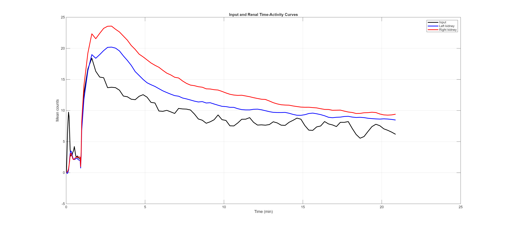
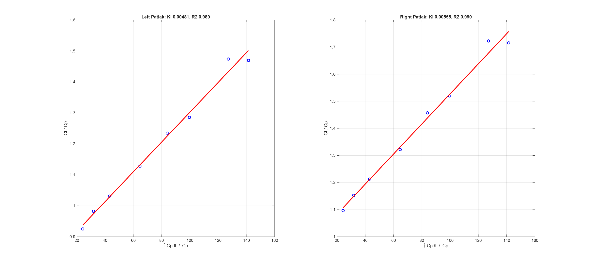
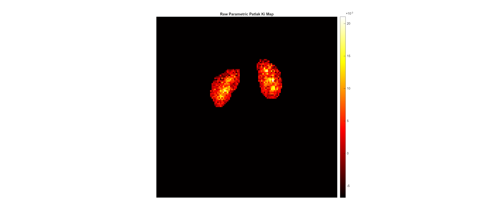
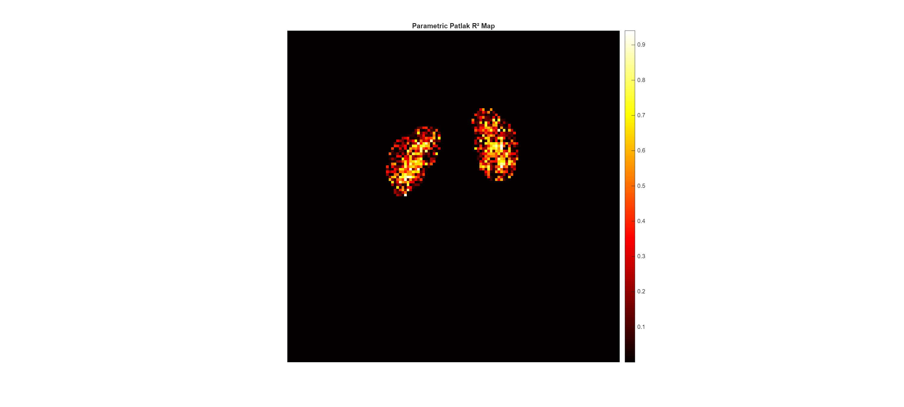
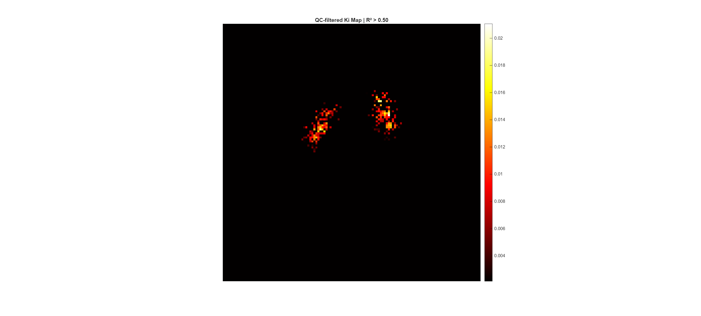

# DTPA Patlak GFR MATLAB Pipeline

## Overview

This repository provides a MATLAB workflow for quantitative analysis of dynamic Tc-99m DTPA renal scintigraphy using Patlak graphical analysis.

The pipeline generates:

* Image-derived vascular input function
* Left and right renal time-activity curves
* ROI-based Patlak Ki
* Ki-derived differential renal function
* Parametric Ki maps
* Parametric R² quality maps
* QC-filtered Ki maps

---

## Workflow
## Example Results

### Input Function and Renal TACs

### ROI Patlak Analysis

### Raw Parametric Ki Map

### Parametric R² Map

### QC-filtered Ki Map

Dynamic DICOM

↓

Input Function Extraction

↓

Renal TAC Extraction

↓

Patlak Graphical Analysis

↓

Ki Estimation

↓

Differential Renal Function

↓

Voxel-wise Patlak Analysis

↓

Parametric Ki Imaging

↓

Quality-Controlled Parametric Maps

---

## Example Outputs

### Input and Renal TACs

### ROI Patlak Analysis

### Raw Ki Map

### Parametric R² Map

### QC-filtered Ki Map

---

## Requirements

* MATLAB R2021a or newer
* Image Processing Toolbox

---

## Author

Muhammad Aleem Khan, MBBS, MSc, FCPS  
Senior Specialist Nuclear Medicine
Ibn Sina Hospital Kuwait
draleemkhan@yahoo.com

---

## Future Development

* Batch processing
* Automated kidney segmentation
* Parametric DRF maps
* Deep learning kidney localization
* Temporal radiomics

 Primary Author

